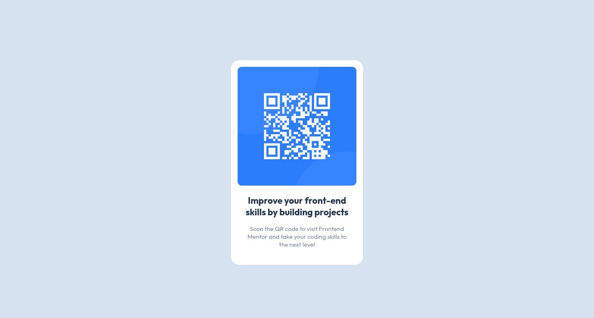

# Frontend Mentor - QR code component solution

This is a solution to the [QR code component challenge on Frontend Mentor](https://www.frontendmentor.io/challenges/qr-code-component-iux_sIO_H). Frontend Mentor challenges help you improve your coding skills by building realistic projects. 

## Table of contents

- [Overview](#overview)
  - [Screenshot](#screenshot)
  - [Links](#links)
- [My process](#my-process)
  - [Built with](#built-with)
  - [What I learned](#what-i-learned)
  - [Continued development](#continued-development)
  - [Useful resources](#useful-resources)
- [Author](#author)
- [Acknowledgments](#acknowledgments)

## Overview

### Screenshot

### Links

- Solution URL: https://github.com/fish-ladder/qr-code-component-main
- Live Site URL: https://fish-ladder.github.io/qr-code-component-main/

## My process

1. Built html doc with the basic structure.
2. Added the design fonts to html head
3. Added the design colors as variables in the stylesheet
4. Determined element dimensions from Figma file
5. Applied fonts and colors to the html elements
6. Struggled with flexbox until I was happy with the layout
7. Little tweaks until I was reasonably OK with the result.

### Built with

- HTML5 markup
- CSS flexbox (probably not required for this but I am trying to become comfortable with it, so I'm using it whenever I can)
- Variables for the design colors (not required but I figured this would be a good practice to try)

### What I learned

I struggled more than I care to admit getting flexbox working how I wanted it to, expecially considering I had just covered the topic in a course. I think what tripped me up was dealing with the change in axis after switching to column layout. Centering the elements vertically didn't work how I thought it should.

I learned the overflow: hidden trick for eliminating the mini-scrolling behaviour when setting height or width to 100vh/vw.

### Continued development

I really want to master flexbox (and grid) since they seem so powerful as layout tools. I would like to get to the point where my expectations of what will happen when I add property:value pairs match the results more often with less confused mumbles from me.

### Useful resources

- [CSS-tricks flexbox poster](https://css-tricks.com/wp-content/uploads/2022/02/css-flexbox-poster.png) - This is a nice cheat sheet that helped me visualize what was happening with flexbox. 

## Author

- Frontend Mentor - [@fish-ladder](https://www.frontendmentor.io/profile/fish-ladder)

## Acknowledgments

I found a lot of Kevin Powell's youtube videos on CSS very helpful - especially the handful of flexbox videos I watched. Lots more to learn from him!

And I must tip my hat to freeCodeCamp for their Responsive Web Design Certification course for introducing me to a lot of web development concepts.

**Note: Delete this note and edit this section's content as necessary. If you completed this challenge by yourself, feel free to delete this section entirely.**
